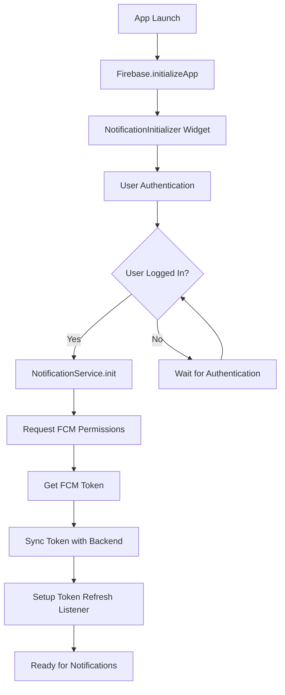

# Push Notifications Implementation Guide

## Overview

This document provides a comprehensive guide to the push notifications implementation in the AcroWorld Flutter application. The system uses Firebase Cloud Messaging (FCM) for cross-platform push notifications with a GraphQL backend integration.

## Table of Contents

1. [Architecture Overview](#architecture-overview)
2. [Packages and Dependencies](#packages-and-dependencies)
3. [Current Implementation Structure](#current-implementation-structure)
4. [Data Models](#data-models)
5. [GraphQL Integration](#graphql-integration)
6. [Service Layer](#service-layer)
7. [Initialization Flow](#initialization-flow)
8. [Notification Handling](#notification-handling)
9. [Product Requirements (PRD)](#product-requirements-prd)
10. [Implementation Status](#implementation-status)
11. [Future Enhancements](#future-enhancements)

## Architecture Overview

The push notification system follows a layered architecture:

```
┌─────────────────────────────────────────┐
│                UI Layer                 │
│  (NotificationInitializer Widget)      │
└─────────────────┬───────────────────────┘
                  │
┌─────────────────▼───────────────────────┐
│            Service Layer                │
│  (NotificationService, FCMService)     │
└─────────────────┬───────────────────────┘
                  │
┌─────────────────▼───────────────────────┐
│          GraphQL Backend                │
│    (Hasura + PostgreSQL)               │
└─────────────────┬───────────────────────┘
                  │
┌─────────────────▼───────────────────────┐
│         Firebase Cloud Messaging       │
│              (FCM Service)             │
└─────────────────────────────────────────┘
```

## Packages and Dependencies

### Core Dependencies

```yaml
# Firebase Core
firebase_core: ^3.13.1

# Firebase Cloud Messaging
firebase_messaging: ^15.2.6

# State Management
riverpod: ^2.6.1
flutter_riverpod: ^2.6.1

# GraphQL
graphql_flutter: ^5.1.0

# Local Storage
shared_preferences: ^2.0.11

# Error Handling & Logging
sentry_flutter: ^8.9.0
```

### Platform-Specific Dependencies

- **iOS**: Requires proper entitlements and APNs configuration
- **Android**: Uses Firebase messaging with Google Play Services
- **Web**: Limited FCM support (currently disabled in implementation)

## Current Implementation Structure

### File Organization

```
lib/
├── notification_initializer.dart          # Main initialization widget
├── services/
│   ├── fcm_service.dart                  # Primary FCM service (newer)
│   └── notification_service.dart         # Legacy notification service
├── data/
│   ├── models/
│   │   ├── fcm/
│   │   │   └── fcm_event.dart           # FCM event data model
│   │   ├── notifications/
│   │   │   └── notification_type.dart   # Notification type constants
│   │   └── user_model.dart              # User model with FCM token
│   └── graphql/
│       └── mutations.dart               # FCM token update mutations
└── provider/riverpod_provider/
    └── user_providers.dart              # User state management
```

## Data Models

### FCM Event Model (`lib/data/models/fcm/fcm_event.dart`)

```dart
class FCMEvent {
  EventType? eventType;
  DateTime? endDate;
  String? locationCountry;
  String? locationCity;
  String name;
  String id;
  String type;
  DateTime? startDate;
  
  // Handles event-related notifications
  // Maps JSON data from FCM payloads
}
```

### User Model (`lib/data/models/user_model.dart`)

```dart
class User {
  // ... other fields
  String? fcmToken;  // Stores user's FCM token
  
  // Parsed from GraphQL user queries
  // Used for token synchronization
}
```

### Notification Types (`lib/data/models/notifications/notification_type.dart`)

```dart
class NotificationType {
  static const String communityMessage = "CommunityMessage";
  // Extensible for future notification types
}
```

## GraphQL Integration

### Mutations for FCM Token Management

#### Update FCM Token (`lib/data/graphql/mutations.dart`)

```graphql
# Basic token update (all users)
mutation UpdateFcmToken($fcmToken: String!) {
  update_users(_set: {fcm_token: $fcmToken}, where: {}) {
    affected_rows
  }
}

# User-specific token update (preferred)
mutation UpdateFcmToken($fcmToken: String!, $userId: uuid!) {
  update_users(_set: {fcm_token: $fcmToken}, where: {id: {_eq: $userId}}) {
    affected_rows
  }
}
```

### Database Schema

The `users` table includes:
- `fcm_token: String` - Stores the device's FCM token
- `id: uuid` - Primary key for user identification

## Service Layer

### Primary FCM Service (`lib/services/fcm_service.dart`)

**Key Features:**
- Permission handling (iOS/Android)
- Token synchronization with backend
- Token refresh listeners
- Caching with SharedPreferences
- User-specific token updates

**Main Methods:**
```dart
class NotificationService {
  // Initialize FCM for authenticated user
  Future<void> init(String userId)
  
  // Sync current token with cached version
  Future<void> _syncToken(String userId)
  
  // Save token to backend via GraphQL
  Future<bool> _saveToken(String userId, String token)
}
```

### Legacy Notification Service (`lib/services/notification_service.dart`)

**Features:**
- Basic FCM initialization
- Token retrieval
- Message handling for different notification types
- Event creation/update notifications
- Navigation handling for notification taps

**Supported Notification Types:**
- `EventCreated`
- `EventUpdated`
- `CommunityMessage`

## Initialization Flow

### App Startup Sequence



### Implementation Details

1. **Firebase Initialization** (`lib/main.dart`)
   ```dart
   await Firebase.initializeApp(
     options: DefaultFirebaseOptions.currentPlatform,
   );
   ```

2. **Notification Initializer** (`lib/notification_initializer.dart`)
   ```dart
   runApp(
     ProviderScope(
       child: NotificationInitializer(child: const App())
     )
   );
   ```

3. **User-Aware Initialization**
   - Listens to user authentication state changes
   - Initializes FCM only when user is logged in
   - Resets state on logout for re-initialization

## Notification Handling

### Message Types

#### Foreground Messages
- Handled via `FirebaseMessaging.onMessage`
- Custom in-app notification display
- No automatic system notification

#### Background Messages
- Handled via `FirebaseMessaging.onBackgroundMessage`
- Automatic system notifications
- Limited processing capabilities

#### App Launch Messages
- Handled via `FirebaseMessaging.getInitialMessage`
- Navigation to specific screens
- Deep linking support

### Current Notification Types

1. **Event Notifications**
   ```dart
   // Event Created
   case "EventCreated":
     // Navigate to event details
     
   // Event Updated  
   case "EventUpdated":
     // Navigate to updated event
   ```

2. **Community Messages**
   ```dart
   case "CommunityMessage":
     // Handle community notifications
   ```

### Navigation Handling

Notifications can trigger navigation to:
- Event detail pages
- Community sections
- User profiles
- Booking confirmations

## Product Requirements (PRD)

### Core Requirements

#### 1. User Authentication Integration
- ✅ FCM tokens are tied to authenticated users
- ✅ Automatic token cleanup on logout
- ✅ Token refresh on re-authentication

#### 2. Cross-Platform Support
- ✅ iOS (with APNs integration)
- ✅ Android (with FCM)
- ⚠️ Web (currently disabled)

#### 3. Notification Categories
- ✅ Event-related notifications
- ✅ Community messages
- 🔄 Booking confirmations (planned)
- 🔄 Teacher invitations (planned)
- 🔄 Payment notifications (planned)

#### 4. Token Management
- ✅ Automatic token refresh
- ✅ Backend synchronization
- ✅ Local caching
- ✅ Duplicate prevention

### User Experience Requirements

#### 1. Permission Handling
- ✅ Graceful permission requests
- ✅ Fallback for denied permissions
- ✅ Re-request capabilities

#### 2. Notification Display
- ✅ Custom in-app notifications
- ✅ System notifications for background
- ✅ Rich notification content

#### 3. Navigation
- ✅ Deep linking from notifications
- ✅ Context-aware routing
- ✅ Fallback for invalid links

## Implementation Status

### ✅ Completed Features

1. **Core Infrastructure**
   - Firebase FCM integration
   - GraphQL backend synchronization
   - Token management and caching
   - User authentication integration

2. **Basic Notification Handling**
   - Foreground message handling
   - Background message processing
   - App launch message handling

3. **Event Notifications**
   - Event creation notifications
   - Event update notifications
   - Navigation to event details

### 🔄 In Progress

1. **Enhanced Notification Types**
   - Community message notifications
   - Booking confirmation notifications
   - Teacher invitation notifications

2. **Improved User Experience**
   - Rich notification content
   - Better error handling
   - Notification preferences

### ⏳ Planned Features

1. **Advanced Features**
   - Scheduled notifications
   - Notification templates
   - A/B testing for notifications

2. **Analytics Integration**
   - Notification delivery tracking
   - User engagement metrics
   - Conversion tracking

3. **Admin Features**
   - Bulk notification sending
   - User segmentation
   - Notification scheduling

## Future Enhancements

### Short-term Improvements

1. **Notification Preferences**
   ```dart
   class NotificationPreferences {
     bool eventNotifications;
     bool communityMessages;
     bool bookingUpdates;
     bool marketingMessages;
   }
   ```

2. **Rich Notifications**
   - Images and media support
   - Action buttons
   - Custom notification sounds

3. **Better Error Handling**
   - Retry mechanisms for failed token updates
   - Offline token caching
   - Network state awareness

### Long-term Vision

1. **Intelligent Notifications**
   - User behavior-based targeting
   - Optimal send time prediction
   - Personalized content

2. **Multi-Channel Support**
   - Email notifications
   - SMS notifications
   - In-app messaging

3. **Analytics Dashboard**
   - Real-time delivery metrics
   - User engagement tracking
   - ROI measurement

## Configuration Requirements

### iOS Configuration

1. **APNs Certificate/Key**
   - Upload to Firebase Console
   - Configure in Apple Developer Portal

2. **Entitlements** (`ios/Runner/Runner.entitlements`)
   ```xml
   <key>aps-environment</key>
   <string>development</string> <!-- or production -->
   ```

3. **Info.plist**
   - Background modes for remote notifications
   - Push notification capability

### Android Configuration

1. **Google Services**
   - `google-services.json` file
   - Firebase project configuration

2. **Manifest** (`android/app/src/main/AndroidManifest.xml`)
   ```xml
   <uses-permission android:name="android.permission.INTERNET" />
   <service
       android:name=".MyFirebaseMessagingService"
       android:exported="false">
   ```

### Backend Configuration

1. **Hasura Setup**
   - FCM token column in users table
   - Appropriate permissions for token updates

2. **Firebase Functions** (if used)
   - Server-side notification sending
   - User segmentation logic

## Testing Strategy

### Unit Tests
- FCM service initialization
- Token synchronization logic
- Notification parsing

### Integration Tests
- End-to-end notification flow
- GraphQL mutation testing
- User authentication integration

### Manual Testing
- Cross-platform notification delivery
- Permission handling scenarios
- Network failure recovery

## Monitoring and Debugging

### Logging
```dart
// Current logging in FCM service
print('🔑 Current FCM token: $currentToken');
print('✅ Notification permission granted');
print('🔕 Notification permission denied');
```

### Error Tracking
- Sentry integration for crash reporting
- Custom error handling for notification failures
- GraphQL mutation error tracking

### Analytics
- Notification delivery rates
- User engagement metrics
- Token refresh frequency

## Security Considerations

### Token Security
- FCM tokens are device-specific
- Automatic token rotation
- Secure backend storage

### User Privacy
- Explicit permission requests
- Granular notification preferences
- GDPR compliance considerations

### Data Protection
- Minimal data in notification payloads
- Encrypted communication
- Secure token transmission

## Conclusion

The AcroWorld push notification system provides a solid foundation for user engagement and real-time communication. The current implementation covers core functionality with room for significant enhancement in user experience, analytics, and advanced features.

The modular architecture allows for easy extension and maintenance, while the GraphQL integration provides flexibility for backend changes. Future development should focus on user experience improvements, advanced targeting, and comprehensive analytics.
